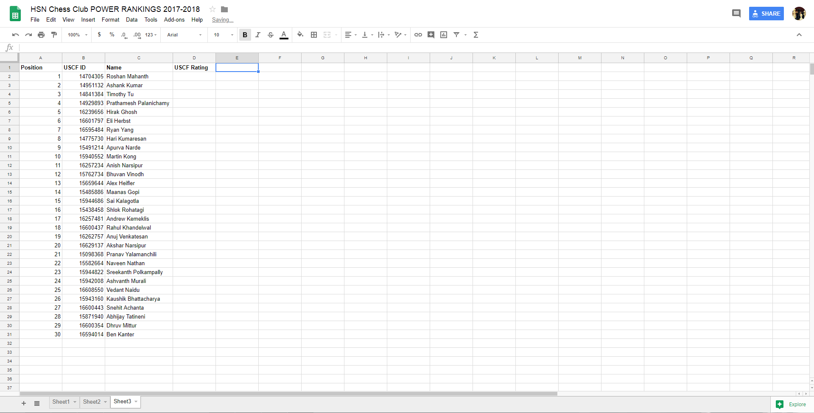

# USCF Power Ranker

Python script that scrapes players ratings from the USCF database, sorts them in rating order, and writes them to a google spreadsheet. Currently the script is built to work for the WWP HSN Chess Club

# Requirements

The script requires [gspread.py](https://github.com/burnash/gspread) and [OAuth2 credentials from Google Developers Console](http://gspread.readthedocs.io/en/latest/oauth2.html). 

In order for the script to work with a spreadsheet of your club create a google spreadsheet that is formatted as seen in the picture:



Then edit line 53 in PowerRanker.py from:

```Python
wks = gc.open("HSN Chess Club POWER RANKINGS 2017-2018").get_worksheet(0)
```

To:

```Python
wks = gc.open("NAME OF YOUR SPREADSHEET HERE").get_worksheet(0)
```

Run the script every month when USCF ratings are officialy updated and the script will handle the ordering of all the players for you!

# To Do

Implement a column that displays the change in a players rank from last month and create a different input of players method and output of players rankings so a google spreadsheets api is not necessary
